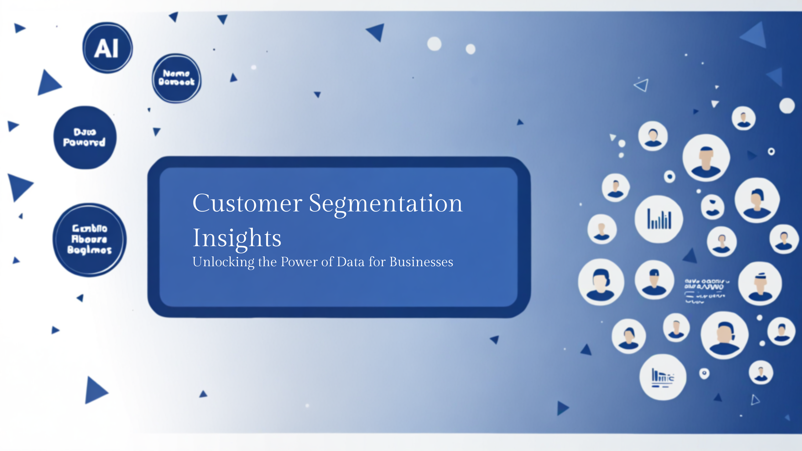
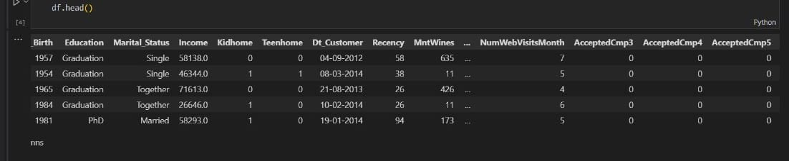
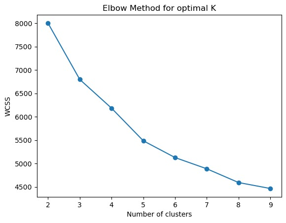
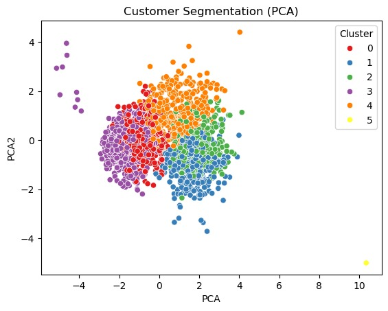

# 🛍️ Customer Segmentation




[](https://www.python.org/)
[](https://github.com/your-username/your-repo/stargazers)
[](https://opensource.org/licenses/MIT)
[](https://github.com/your-username/your-repo/issues)


## 📋 Table of Contents
- 🤖 Introduction  
- ⚙️ Tech Stack  
- 🔋 Features  
- 🤸 Quick Start  
- 🕸️ Project Structure  
- 📊 Results  
- 🔗 Links  

---

## 🤖 Introduction
Welcome to the **Customer Segmentation Project**!  
This project applies **KMeans clustering** to group customers into segments based on purchasing behavior. The goal is to help businesses design **personalized marketing strategies** and improve customer experience.
- Dataset Preview
- 
---

## ⚙️ Tech Stack
- Python 🐍  
- Pandas, NumPy  
- Scikit-learn  
- Matplotlib, Seaborn  
- Jupyter Notebook  

---

## 🔋 Features
👉 Data Preprocessing (scaling, cleaning, encoding)  
👉 KMeans Clustering to identify customer groups  
👉 Elbow Method for optimal cluster selection  
👉 Visualization of clusters with 2D plots  
👉 Exported trained model (`kmean_model.pkl`) and scaler (`scaler.pkl`)  
👉 Usable as both Notebook (`segmentation.ipynb`) and Script (`segmentation.py`)  

---

## 🤸 Quick Start

### Prerequisites
- Python 3.8+  
- pip (Python package manager)  

### Cloning the Repository
```bash
git clone https://github.com/manasa1311/customer-segmentation.git
cd customer-segmentation
```
### Installation 
```bash
- pip install -r requirements.txt
```
### Running the Project
```bash
- jupyter notebook segmentation.ipynb
or run the Python script
- python segmentation.py
```
### 🕸️ Project Structure
customer-segmentation/
├── customer_data/          # Dataset
├── kmean_model.pkl         # Trained model
├── scaler.pkl              # Scaler used for preprocessing
├── segmentation.ipynb      # Jupyter Notebook (EDA + training)
├── segmentation.py         # Python script
├── requirements.txt        # Dependencies
└── README.md               # Project documentation

### 📊 Results
- Optimal number of clusters: 4
- Cluster 1: High income – high spending
- Cluster 2: Low income – low spending
- Cluster 3: High income – low spending
- Cluster 4: Low income – high spending
- Clear separation of customer groups.
- Useful for targeted marketing and business strategy.
- Elbow curve i used to select the number of clusters:
- 
- Scatter plot of Annual Income vs Spending score with clusters:
- 
### 🔗 Links
📂 Dataset
 [Dataset](https://www.kaggle.com/datasets/vishakhdapat/customer-segmentation-clustering)
📊 Run on Google Colab
[GoogleColab](https://colab.research.google.com/drive/1O_iuoQ2VgsDlNxq818E8TUnh-5Xjay-n?usp=sharing)
